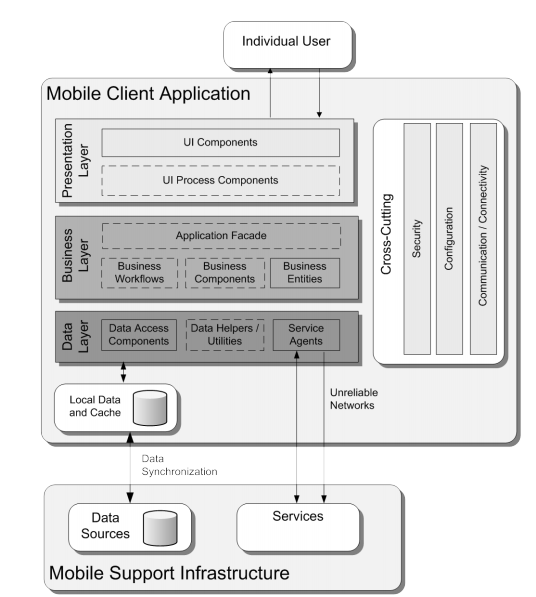
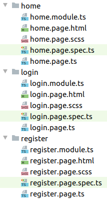
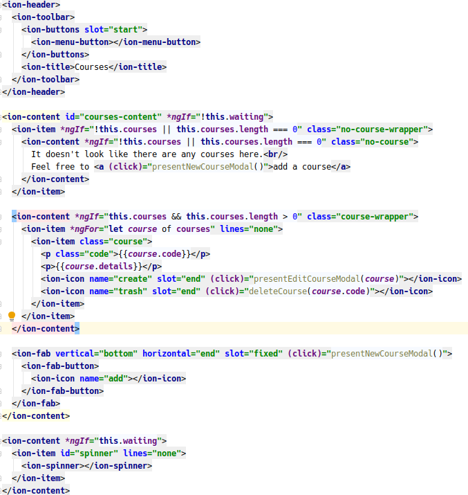
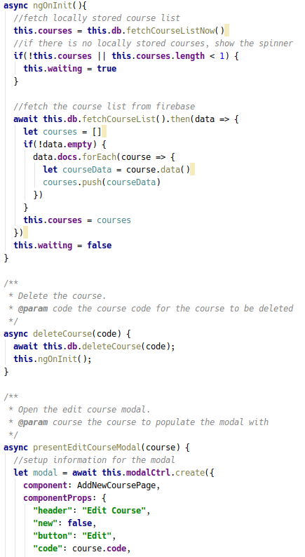
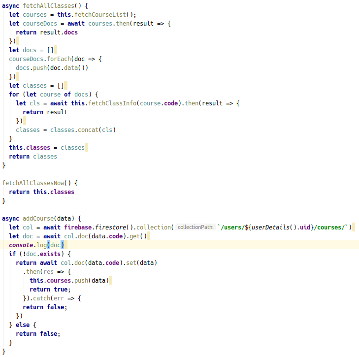
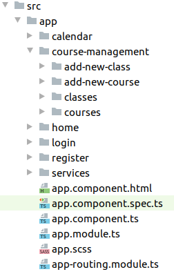
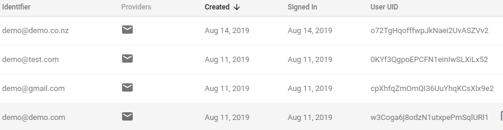

### SWEN325 Assignment 1 Report
###### Philip Oliver 300398228

#### Application Architecture

Mobile application architecture is split into 4 layers. These layers are: Presentation, 
Business, Data Access, and Service. In an ideal architecture, these 4 layers will be seperate 
from each other.

  
*Image from 'Mobile Architecture Guide': Microsoft*

##### Presentation Layer

The presentation layer in an Ionic application is typically represented in the 
HTML and CSS files, and the Ionic components which are converted to HTML elements
for display. Due to Ionic automatically separating the HTML, CSS, and typescript 
files, the presentation layer is separated from the other layers.  

The separate files can be seen in the above image.

The above HTML file shows the use of standard HTML components such as \<p\> 
tags as well as the \<ion\> tags. 

##### Business Layer

The business layer in an Ionic application is represented by the page.ts files.
These files are the logic required by the application in processing user inputs, 
how to send data to the presentation layer, and the relationships between pages.

The above image shows these processes: the fetchCourseList and deleteCourse 
functions provide the bridge between the presentation layer and the data access 
layer though this processing, and the presentEditCourseModal provides some 
navigation between pages.

##### Data Access Layer

My implementation of the data access layer in my Ionic app was through the use
of services. These services were stored separately from the pages in a separate
folder and provided an interface between the business layer and the services.
The services created were an authentication service, a database service, and a 
utility service, which provided functionality which was shared by multiple pages 
in the business layer.

The above image shows 2 main pieces of functionality provided by the database 
service. The functions fetchAllClasses and addCourse provide an interface for
accessing and manipulating the data stored in the services. 

##### Services

The service agents in the data access layer communicate with firebase 
in order to provide authentication and user storage. Between these two 
layers is a local cache. This cache stores data received from firebase 
and edits the local copies when a user edits the items before sending the 
changes or fetching from the externally stored firebase. This allows for quicker
response times when fetching data, and semi-persistent storage in case the
phone's connection is unreliable. 

##### Organisation

The organisation of my folders can be seen above. The main pages are each 
in their own folders, with the pages relating to courses and classes as subfolders 
within the course-management folder. The services are separate in the services 
folder, and any overall app design information is stored in the top-level files,
as is by default in an Ionic application.

##### Cross-Cutting

A cross-cutting component I made use of in my application was an authentication 
guard. This authentication guard provided security by only allowing access to pages
that were not the login or register page to logged in users.

#### Major External Component

The major external component I used for my application was Firebase. 
I made use of both the authentication and database services of Firebase.

##### Authentication

##### Database
